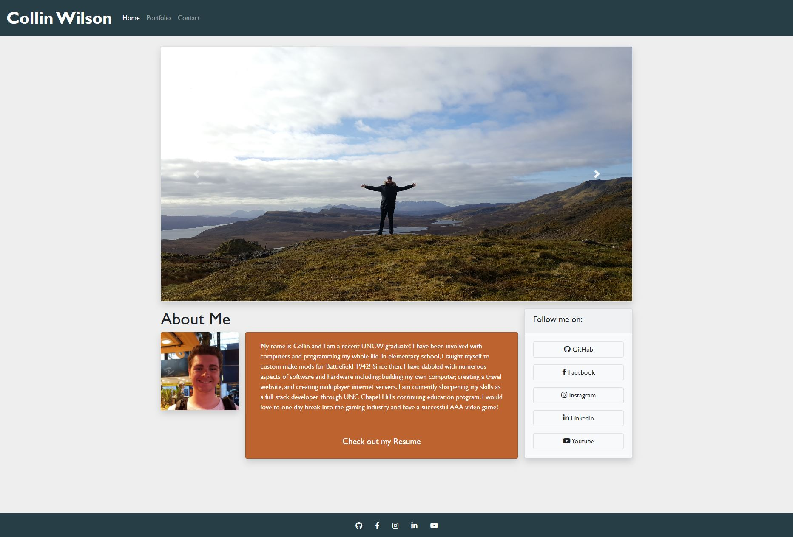

# Responsive-Portfolio
Responsive portfolio for homework
Here is my responsive portfolio. It is made using bootstrap and custom css. This is a work in progress and will eventually be turned into my main website for myself once my coding skills get better!

Here is the working link to the site: https://wilsoncollin7.github.io/Portfolio/

Here is a snip of the front page:

